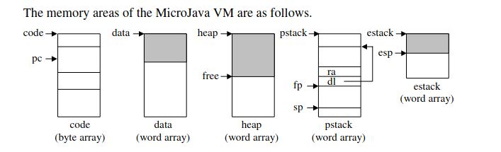

# MicroJava_Compiler


The compiler works through four phases: 

 - the lexer (mjlexer.lex) recognizes code syntax
 - the parser (mjparser.cup) builds a Obj tree as it parses through the
   code
 - the semantic analyzer (SemanticAnalyzer.java) visits the tree in
   postorder to check for errors
 - the code generator (CodeGenerator.java) generates MicroJava code as
   it visits the tree in postorder

This is all compiled through the Compiler.java file.

## 	Introduction
**MicroJava** is a _high-level programming language_. As the name suggests, **MicroJava** is _similar_ to **Java** (which you are, probably, already familiar with), but it's _simpler_. Similarly to Java, MicroJava source files are compiled to **bytecode**, which is then executed by a **virtual machine** (it's called (as you might have guessed) **MicroJava Virtual Machine**). MicroJava VM is a simple _interpretative emulator_ (i.e. it does not have any support for some "fancy" techniques such as, e.g., _Just-In-Time compilation_).
 
 
 ## Main language features

-   A MicroJava program consists of a single program file with static fields and static methods. There are no external classes but only inner classes that can be used as data types.
-   The main method of a MicroJava program is always called main(). When a Micro-Java program is called this method is executed.
-   There are
    -   Constants of type int (e.g. 3) and char (e.g. 'x') but no string constants.
    -   Variables: all variables of the program are static.
    -   Primitive types: int, char (Ascii)
    -   Reference types: one-dimensional arrays like in Java as well as classes with fields but without methods.
    -   Static methods in the main class.
-   There is no garbage collector (allocated objects are only deallocated when the program ends).
-   Predeclared procedures are ord, chr, len.

 ### Syntax
```
Program     = ʺprogramʺ ident {ConstDecl | VarDecl | ClassDecl} ʺ{ʺ {MethodDecl} ʺ}ʺ.
ConstDecl   = ʺconstʺ Type identʺ=ʺ(numConst | charConst | boolConst) {, ident ʺ=ʺ 
(numConst | charConst | boolConst)} ʺ;ʺ. 
VarDecl     = Type ident [ʺ[ʺ ʺ]ʺ] {ʺ,ʺ ident [ʺ[ʺ ʺ]ʺ]} ʺ;ʺ. 
RecordDecl = ʺrecordʺ ident ʺ{ʺ {VarDecl} ʺ}ʺ.
ConstructorDecl = ident ʺ(ʺ ʺ)ʺ {VarDecl} ʺ{ʺ {Statement} ʺ}.
ClassDecl   = ʺclassʺ ident [ʺextendsʺ Type] ʺ{ʺ  {VarDecl}  [ʺ{ʺ {MethodDecl} ʺ}ʺ]  ʺ}ʺ. 
MethodDecl  =   (Type | ʺvoidʺ) ident ʺ(ʺ [FormPars] ʺ)ʺ {VarDecl} ʺ{ʺ {Statement} ʺ}ʺ. 
FormPars    = Type ident [ʺ[ʺ ʺ]ʺ] {ʺ,ʺ Type ident [ʺ[ʺ ʺ]ʺ]}. 
Type        =  ident. 
Statement   =  DesignatorStatement  ʺ;ʺ  
            |  ʺifʺ ʺ(ʺ Condition ʺ)ʺ Statement [ʺelseʺ Statement]  
            | ʺdoʺ Statement ʺwhileʺ ʺ(ʺ Condition ʺ)ʺ ʺ;ʺ 
            | ʺswitchʺ ʺ(ʺ Expr ʺ)ʺ ʺ{ʺ {ʺcaseʺ numConst ʺ: ʺ {Statement} } ʺ}ʺ 
            |  ʺbreakʺ ʺ;ʺ 
            | ʺcontinueʺ ʺ;ʺ 
            | ʺreturnʺ [Expr] ʺ;ʺ  
            |  ʺreadʺ ʺ(ʺ Designator ʺ)ʺ ʺ;ʺ  
            |  ʺprintʺ ʺ(ʺ Expr [ʺ,ʺ numConst] ʺ)ʺ ʺ;ʺ  
            | ʺ{ʺ {Statement} ʺ}ʺ. 
DesignatorStatement = Designator (Assignop Expr | ʺ(ʺ [ActPars] ʺ)ʺ | ʺ++ʺ | ʺ‐‐ʺ) 
ActPars     =  Expr {ʺ,ʺ Expr}. 
Condition   =   CondTerm {ʺ||ʺ CondTerm}. 
CondTerm    =   CondFact  {ʺ&&ʺ CondFact}. 
CondFact    =  Expr [Relop Expr]. 
Expr        =  [ʺ-ʺ] Term {Addop Term} 
            |   Condition ʺ?ʺ Expr ʺ:ʺ Expr                    
            |   CondFact ʺ?ʺ Expr ʺ:ʺ Expr.                   
Term        =  Factor {Mulop Factor}. 
Factor      = Designator [ʺ(ʺ [ActPars] ʺ)ʺ]  
            |  numConst  
            |  charConst     
            |   boolConst   
            |  ʺnewʺ Type [ʺ[ʺ Expr ʺ]ʺ] 
            | ʺ(ʺ Expr ʺ)ʺ 
Designator  =  ident {ʺ.ʺ ident | ʺ[ʺ Expr ʺ]ʺ}. 
Assignop    = ʺ=ʺ. 
Relop       =  ʺ==ʺ | ʺ!=ʺ | ʺ>ʺ | ʺ>=ʺ | ʺ<ʺ | ʺ<=ʺ. 
Addop       =  ʺ+ʺ | ʺ‐ʺ. 
Mulop       =  ʺ*ʺ | ʺ/ʺ | ʺ%ʺ.

```

`ident`  is a non-empty sequence of alphanumeric characters and  `_`, starting with letter.  `numConst`  is a sequence of one or more decimal digits.  `charConst`  is a sequence starting with  `'`  followed by a single printable character and ending with  `'`.  `boolConst`  is either  `true`  or  `false`.

MicroJava's single line comment starts with two forward slashes with no white spaces (`//`) and lasts till the end of line.

### MicroJava VM

The MicroJava VM is similar to the Java VM but has less and simpler instructions.  
Whereas the Java VM uses operand names from the constant pool that are resolved by the loader, the MicroJava VM uses fixed operand addresses. Java instructions encode the types of their operands so that a verifyer can check the consistency of an object file. MicroJava instructions do not encode operand types.

Memory layout:


